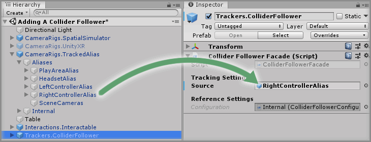
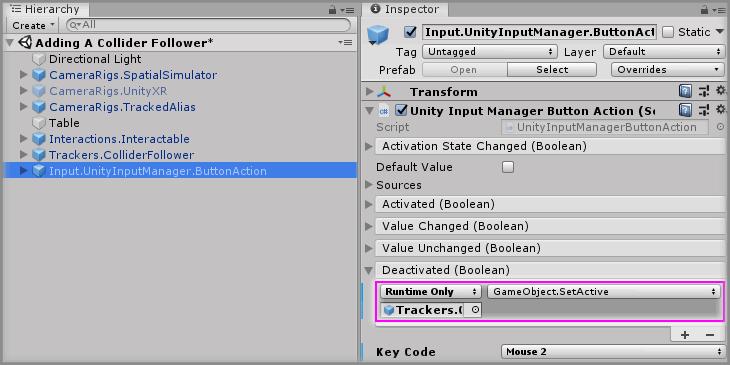
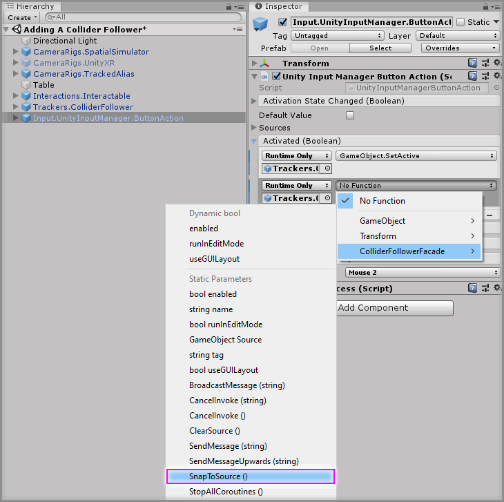
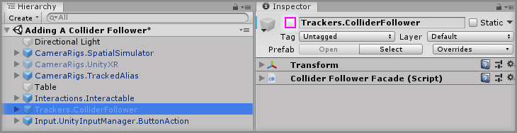

# Addding A Collider Follower

> * Level: Beginner
>
> * Reading Time: 5 minutes
>
> * Checked with: Unity 2018.3.14f1

## Introduction 

A `Collider Follower` is a simple prefab that enables a [Unity] collider to follow the GameObject around the scene and be able to interact with physics. One useful example is being able to push interactable objects around with the Interactor without having to grab it.

## Prerequisites

* [Add the Tilia.Interactions.Interactables.Unity] prefab to the scene Hierarchy.
* [Install the Tilia.Interactions.Interactables.Unity] package dependency in to your Unity project.

## Let's Start

### Step 1 

Expand the `Tilia Trackers ColliderFollower Unity` Package directory in the Unity Project window and select the `Packages -> Tilia Trackers ColliderFollower Unity -> Runtime -> Prefabs` directory then drag and drop the `Trackers.ColliderFollower` prefab into the Unity hierarchy window.

### Step 2 

We will get this collider to follow our Interactor, so expand `CameraRigs.TrackedAlias -> Aliases` and drag and drop `RightControllerAlias` onto the `Source` parameter of the `Collider Follower Facade` component. This will make our `Trackers.ColliderFollower` GameObject follow our Right Controller around.

### Step 3

Let's make our Collider Follower's collider match our Interactor's shape. Expand the `Trackers.ColliderFollower` GameObject, select the `Collider` GameObject.

Disable the `Sphere Collider` and create a `Box Collider` and set the Collider properties to:

Size: `X = 0.02`, `Y = 0.02`, `Z = 0.01`

Play the Unity Scene. Notice how the Left Controller can pass right through the cube whereas the Right Controller will push the cube. In the next step we are going to have a button to turn on and off our `Collider Follower`.

### Step 4

Expand the `Tilia Input UnityInputManager Unity` Package directory in the Unity Project window and select the `Packages -> Tilia Input UnityInputManager Unity -> Runtime -> Prefabs` directory then drag and drop the `Input.UnityInputManager.ButtonAction` prefab into the Unity hierarchy window. 

We are going to use the middle mouse button to activate and deativate the `Trackers.ColliderFollower` GameObject. Set the `Key Code` parameter in the `Unity Input Manager Button Action` component to `Mouse 2`.

### Step 5

Select the `Input.UnityInputManager.ButtonAction` GameObject from the Unity Hierarchy and click the `+` symbol in the bottom right corner of the `Activated` event parameter on the `Unity Input Manager Button Action` component. Drag and drop the `Trackers.ColliderFollower` GameObject into the event listener box that appears on the `Activated` event parameter on the `Unity Input Manager Button Action` component that displays `None (Object)`.

Select a Function to perform when the `Activated` event is emitted. For this example select the `GameObject -> Set Active` (be sure to select `Dynamic GameObject - SetActive` for this example)

> Do the same for the `Deactivated` event.

### Step 6

Select the `Input.UnityInputManager.ButtonAction` GameObject from the Unity Hierarchy and click the `+` symbol in the bottom right corner of the `Activated` event parameter on the `Unity Input Manager Button Action` component. Drag and drop the `Trackers.ColliderFollower` GameObject into the event listener box that appears on the `Activated` event parameter on the `Unity Input Manager Button Action` component that displays `None (Object)`. 

Select a function to perform when the `Activated` event is emitted. For this example, select the `Trackers.ColliderFollower -> SnapToSource()` function (be sure to select `Static Parameters - SnapToSource()` for this example).

### Step 7

Disable to `Trackers.ColliderFollower` GameObject in the Unity hierachy, so it's not enabled by default.

### Done

Play the Unity scene, pass the right controller through the cube, it will go right through the cube until you press the middle mouse button which will allow it to push and interact with the cube.

[Add the Tilia.Interactions.Interactables.Unity]: https://github.com/ExtendRealityLtd/Tilia.Interactions.Interactables.Unity/blob/master/Documentation/HowToGuides/AddingAnInteractable/README.md
[Install the Tilia.Interactions.Interactables.Unity]: ../Installation/README.md
[Unity]: https://unity3d.com/