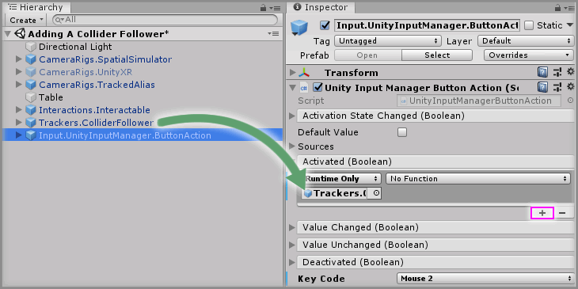

# Adding A Collider Follower

> * Level: Beginner
>
> * Reading Time: 5 minutes
>
> * Checked with: Unity 2018.3.14f1

## Introduction 

The `Trackers.ColliderFollower` prefab enables a [Unity] collider to follow the GameObject around the scene and be able to interact with physics. One useful example is being able to push interactable objects around with the Interactor without having to grab it.

## Prerequisites

* [Add the Tilia.Interactions.Interactables.Unity -> Interactions.Interactable] prefab to the scene hierarchy.
* [Install the Tilia.Trackers.ColliderFollower.Unity] package dependency in to your Unity project.

## Let's Start

### Step 1 

Add a `Trackers.ColliderFollower` prefab to the Unity project hierarchy by selecting `GameObject -> Tilia -> Prefabs -> Trackers -> Trackers.ColliderFollower` from the Unity main top menu.

### Step 2 

We will get this collider to follow our Interactor, so expand `CameraRigs.TrackedAlias -> Aliases` and drag and drop `RightControllerAlias` onto the `Source` parameter of the `Collider Follower Facade` component. This will make our `Trackers.ColliderFollower` GameObject follow our Right Controller around.

### Step 3

Let's make our Collider Follower's collider match our Interactor's shape. Expand the `Trackers.ColliderFollower` GameObject, select the `Collider` GameObject.

First disable existing the `Sphere Collider` component then click the `Add Component` button and select the `Box Collider` component to add a `Box Collider` to the `Trackers.ColliderFollower -> Collider` GameObject, then set the `Collider` properties to:

Size: `X = 0.02`, `Y = 0.02`, `Z = 0.1`

Play the Unity scene. Notice how the Left Controller can pass right through the cube whereas the Right Controller will push the cube. In the next step we are going to have a button to turn on and off our `Collider Follower`.

### Step 4

Add a `Input.UnityInputManager.ButtonAction` prefab to the Unity project hierarchy by selecting `GameObject -> Tilia -> Prefabs -> Input -> UnityInputManager -> Actions -> Input.UnityInputManager.ButtonAction` from the Unity main top menu.

We are going to use the middle mouse button to activate and deactivate the `Trackers.ColliderFollower` GameObject. Set the `Key Code` parameter in the `Unity Input Manager Button Action` component to `Mouse 2`.

### Step 5

Select the `Input.UnityInputManager.ButtonAction` GameObject from the Unity Hierarchy window and click the `+` symbol in the bottom right corner of the `Activated` event parameter on the `Unity Input Manager Button Action` component. Drag and drop the `Trackers.ColliderFollower` GameObject into the event listener box that appears on the `Activated` event parameter on the `Unity Input Manager Button Action` component that displays `None (Object)`.

Select a Function to perform when the `Activated` event is emitted. For this example select the `GameObject -> Set Active` (be sure to select `Dynamic GameObject - SetActive` for this example)

> Do the same for the `Deactivated` event.

### Step 6

Select the `Input.UnityInputManager.ButtonAction` GameObject from the Unity Hierarchy window and click the `+` symbol in the bottom right corner of the `Activated` event parameter on the `Unity Input Manager Button Action` component. Drag and drop the `Trackers.ColliderFollower` GameObject into the event listener box that appears on the `Activated` event parameter on the `Unity Input Manager Button Action` component that displays `None (Object)`. 

Select a function to perform when the `Activated` event is emitted. For this example, select the `Trackers.ColliderFollower -> SnapToSource()` function (be sure to select `Static Parameters - SnapToSource()` for this example).

### Step 7

Disable the `Trackers.ColliderFollower` GameObject in the Unity Hierarchy window so it's not enabled by default.

### Done

Play the Unity scene and move the right controller through the Cube Interactable GameObject. Notice how it will go completely through the Cube Interactable GameObject. Now press the middle mouse button, which will enable the Collider Follower and the right controller will push the Cube Interactable around the scene.

[Add the Tilia.Interactions.Interactables.Unity -> Interactions.Interactable]: https://github.com/ExtendRealityLtd/Tilia.Interactions.Interactables.Unity/blob/master/Documentation/HowToGuides/AddingAnInteractable/README.md
[Install the Tilia.Trackers.ColliderFollower.Unity]: ../Installation/README.md
[Unity]: https://unity3d.com/